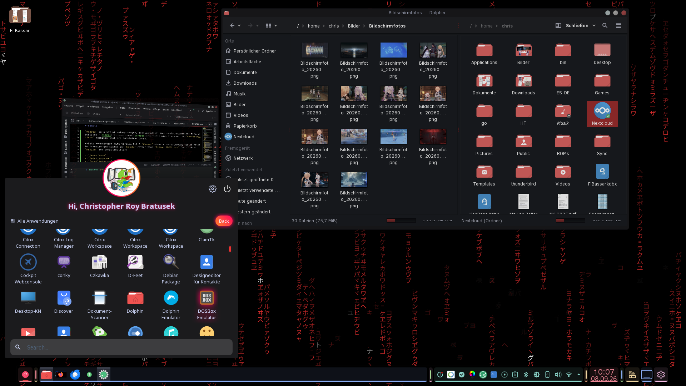
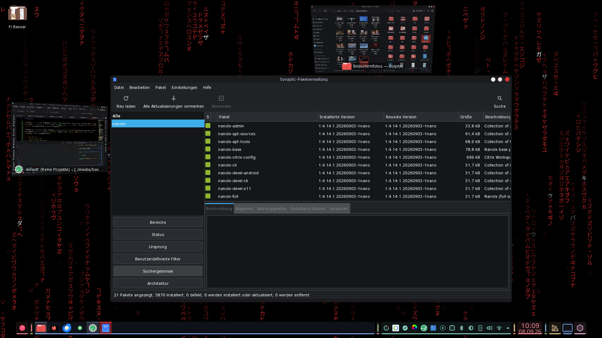

# Nanolx

`Nanolx` is a set of meta-packages, configuration files (optionally, maintained through scripts) and [scripts](#scripts), I use on my `Debian GNU/Linux` machines.

**Note:** starting with version 5.0.0 `Nanolx` diverts the following system files to identify the system as `Nanolx` rather than `Debian GNU/Linux` (but "like" `Debian` for compatibility):

- `/etc/issue`
- `/etc/issue.net`
- `/etc/motd`
- `/usr/lib/os-release`

once `nanolx-base` package is installed. The diversion is reverted upon removal or purge of that package.

*There's no technical reason for this - I've just put much time and love into this project so consider this self-praise.*

The package `nanolx-themes` will set `debian-mac-style` as the default `Plymouth` theme upon **first** install (not on upgrades), as well as `rEFInd-digital-void` as default `refind` theme. Both changes will be reverted upon package removal or purge.

While I'm not actively looking for donations, a tip is always welcome.

## Release Information

see [debian/changelog](https://gitlab.com/Nanolx/nanolx/-/blob/master/debian/changelog?ref_type=heads) for changes

- Version:      5.0.0
- Release:      20260910
- Codename:     Equinox

## Git repository access

You can access the source from

- [GitLab Repository](https://gitlab.com/Nanolx/nanolx)

## Installation on Debian GNU/Linux

`Nanolx` is distributed via Git repository above or through my personal `Photonic` [apt repository](https://nanolx.org/posts/photonic/). Get it's signing key located at:

[https://www.nanolx.org/apt/photonic2026.asc](https://www.nanolx.org/apt/photonic2026.asc)

and save it as:
* /etc/apt/trusted.gpg.d/nanolx2026.asc

create:
* /etc/apt/sources.list.d/nanolx.sources

with the following content:

    Types: deb deb-src
    URIs: https://apt.nanolx.org/
    Suites: photonic
    Components: main
    Signed-By: /etc/apt/trusted.gpg.d/nanolx2026.asc

then proceed to install. Install either

- `nanolx-base` + selected individual packages
    - `nanolx-base` only requires `nanolx-apt-sources` and `nanolx-apt-tools`
- `nanolx-full` for all packages except nanolx-citrix-config

**Note:** `Nanolx` is built to be used with `Debian Sid` (unstable), additionally some of the sub-packages depend on packages only available from the `deb-multimedia` or my own `Photonic` repository, so both are considered required for `nanolx-full`. See also: `nanolx-apt` [script](#scripts) below.

## For non Debian GNU/Linux-Users

On `Debian`-based distributions (like `Ubuntu`) you'll likely not be able to meet all dependecies of the meta-packages. In that case you can use

    [./]make install

to install included scripts (see below), configurations and themes. If you only want to install the scripts, use

    [./]make scripts

and lastly if you only want to update the configuration files the scripts, use

    [./]make updateconf

On non Debian-based distributions you'll be able to use the [scripts](#scripts):

* `hugo-push`
* `nanolx-backup` (if `systemd` is in use)
* `nanolx-ctx`
* `nanolx-gtksettings-kde`
* `nanolx-skel`
* `nanolx-pam-yubikey`
* `nanolx-refind`

you may want to install them manually if desired.

## License

`Nanolx` is licensed under the GNU GPL v3 (or newer).

## Packages

refer to [debian/control](https://gitlab.com/Nanolx/nanolx/-/blob/master/debian/control?ref_type=heads) for full description and pulled packages.

1. `nanolx-full`
    * pulls all packages below, except `nanolx-citrix-config`
2. `nanolx-base`
    * base-package pulling `nanolx-apt-sources` and `nanolx-apt-tools`
    * diverts the system identification from `Debian` to `Nanolx`
3. `nanolx-admin`
    * pulls cli and gui tools for system administration, like gkdebconf, localepurge, packagesearch or cruft-ng.
4. `nanolx-apt-sources`
    * provides additional, curated, apt repositories - which are not enabled by default, see the `nanolx-apt` [script](#scripts) below.
5. `nanolx-apt-tools`
    * pulls nanolx-apt-sources and additional tools regarding apt, like gdebi, reprepro, debdelta.
6. `nanolx-cli`
    * pulls a collection of command line utilities, like rsync, mc, unp, plocate, bashstyle-ng and more.
7. `nanolx-x11`
    * pulls a small collection of ui tools, like psensor, conky, libgtk-nocsd0 and KDE/Plasma.
8. `nanolx-security`
    * pulls a collection of security related tools, like psad, lynis, rkhunter, clamav.
9. `nanolx-net`
    * pulls a collection of networking and connectivity tools, like firefox, thunderbird, kvirc, syncthing or nextcloud-desktop.
10. `nanolx-media-codecs`
    * pulls additional codes for gstreamer, aswell as libdvdcss2 and libbluray2.
11. `nanolx-media-cli`
    * pulls cli media tools, like lame, sox, flac, streamripper or cdparanoia.
12. `nanolx-media-x11`
    * pulls ui media tools, like audacity, geeqie, okular, gimp, k3b and more.
13. `nanolx-devel-cli`
    * pulls cli development tools, like ccache, schroot, sbuild, gcc/g++, lintian, gdb, code checking tools and more.
14. `nanolx-devel-android`
    * pulls android related tools, like adb, fastboot, gradle and more.
15. `nanolx-devel-x11`
    * pulls ui development tools, like cambalache, geany, bluefish, qownnotes and more.
16. `nanolx-games`
    * pulls a collection of games, including FreedroidRPG, Globulation2, Pingus, Supertuxkart, Lincity-NG, Neverball, Lutris Launcher and Zelda fan games.
17. `nanolx-games-emu`
    * pulls a collection of emulators, including dosbox, retroarch and more.
18. `nanolx-office`
    * pulls a collection of office related packages, like libreoffice, okular, gnucash or scantpaper.
19. `nanolx-yubikey`:
    * collection of `Yubikey` related tools.
20. `nanolx-themes`
    * this package installs the default theme collection I use, see [themes](#themes) below.
    * use `konsave -i /usr/share/nanolx/Nanolx.knsv` followed by `konsave -a Nanolx` if you want to apply the full KDE theme suite.
    * sets the default `Plymouth` theme to `debian-mac-style` and the default `refind` theme to `rEFInd-digital-void` upon first install (only).
21. `nanolx-citrix-config`
    * see [Citrix](#citrix) below.

## Scripts

`Nanolx` includes a set of scripts, all ship their own manpage (`man <scriptname>`) and bash completion.

1. `nanolx-base`
    1. `nanolx-backup`   create and manage `systemd` timers for rsync backups alternatively create backup triggers for when a specific device/partition was plugged in (sends desktop notifications).
    2. `nanolx-skel`     enable or disable `Nanolx` skel files (`/usr/share/nanolx/skel`) for newly created users instead of `/etc/skel`.
        * **Note**: you most likely don't want that.
    3. `conky-on-second-screen`  uses `ydotool` to force `conky` on second screen. This is part of the `Nanolx` skel files, so not installed to `/usr`, see `skel/bin` if you want to check it. *If* you would be using the `Nanolx` skel the script would be installed to `${HOME}/bin`
2. `nanolx-apt-sources`
    1. `nanolx-apt`      manages additional repository configurations, including key handling, aswell as matching pinning and apt configuration changes (both optional). Currently supported repos are:
        - debian (rolls-out full suite stable->experimental)
        - nanolx
        - liquorix
        - i2p
        - winehq
        - deb-multimedia
        - mozilla
3. `nanolx-apt-tools`
    1. `repokit`         personal wrapper script for `reprepro`, `sbuild` and `dpkg-buildpackage` with config file support, auto ftp-upload and more features.
    2. `nanolx-orbit`    manages installation of 3rdparty packages, including checking sha256sums, currently supported packages:
        - citrix (stable)
        - citrix-usb (stable)
        - citrix-epa (stable)
        - citrix-beta (GCC 11 tech preview)
        - citrix-beta-usb (GCC 11 tech preview)
        - zoom
        - zoom vdi plugin
4. `nanolx-citrix-config`
    1. `nanolx-ctx`      script to disable (or reenable) `Citrix` telemetry, allowing/restricting access to local machine, running the included system check script, enable `Teams` or `Zoom` optimizations, see `man nanolx-ctx` or `nanolx-ctx --help`. It also allows to install or uninstall the webkit2gtk-4.0 bundled with `Citrix`, which is required for full `Citrix` operation (stable `Citrix` version), but no longer shipped with `Debian`, if you're using the `Citrix` GCC 11 tech preview, those compatibility options will be disabled.
5. `nanolx-net`
    1. `hugo-push`     simple script to build a `hugo` website and push it to webspace using lftp, uses a configuration file.
6. `nanolx-yubikey`
    1. `nanolx-pam-yubikey`  script to enable password-less logins when a recognized `Yubikey` is plugged in, using **PAM**, currently hooked-into **PAM** modules:
        - login
        - sddm
        - su
        - sudo
        - sudo-i
        - polkit-1
        - kde

        optionally, the script can tell `logind` to lock the session, as soon as the `Yubikey` is plugged out.
7. `nanolx-themes`
    1. `nanolx-refind`   simple script to manage `rEFInd` bootloader themes, supports showing installed themes, setting theme, showing current theme in use or reverting to default, aswell as ensuring `refind` stays default when `grub` or `shim` got updated.
8. `nanolx-x11`
    1. `nanolx-gtksettings-kde`     This scripts reads KDE's theme, icon, font, toolbar settings and creates Gtk3 (through ini file) and Gtk4 (through gsettings) configuration, as close as possible. Note that Adwaita apps may ignore some settings, additionally you may apply those settings to **root** aswell (imagine opening `Synaptic` at night without beeing blinded).

## Themes

Use `konsave -i /usr/share/nanolx/Nanolx.knsv` followed by `konsave -a Nanolx` if you want to apply the full KDE theme suite.

The package `nanolx-themes` installs the following themes and effects, which are available in my `Photonic` apt repository. If you choose to not install `nanolx-themes` (or `nanolx-full`, which depends on `nanolx-themes`), you can install them individually.

1. `refind-theme-digital-void`: Futuristic red theme for rEFInd
2. `empty-butterfly-cursors`: Come in blue, butter, cyan, green, magenta, orange, purple, red, white and yellow.
3. `tela-icon-theme-red`:  Tela icon theme (Red variant)
4. `tela-icon-theme-red-dark`: Tela icon theme (Red Dark variant)
5. `plasma-global-theme-nothing`: Plasma theme inspired by Nothing design language
6. `kvantum-midnight-bright`: comes in blue, green, purple, red and yellow
7. `kwin-effect-geometry-change`: KWin animation for windows moved/resized by programs/scripts
8. `kwin-effect-aura-glow`: KWin aura glow animation for created/deleted windows
9. `kwin-script-kneko`: An Oneko-style script implemented in kwinscript
10. `kwin-script-kzones`: KDE KWin Script for snapping windows into zones
11. `kwin-script-remember-window-positions`: KWin Script for remembering application window properties
12. `kde-syntax-theme-revolunti`: syntax highlighting theme for Kate/KDevelop
13. `plasma-andromeda-launcher`: A simple Launcher for KDE Plasma based on the mmcklauncher
14. `plasma-kde-control-station`: A beautiful and modern configuration center for KDE plasma based on the kde_controlcentre
15. `plasma-advanced-separator`: Customizable separator widget for the KDE Plasma Desktop
16. `plasma-panel-colorizer`: Fully-featured widget to bring Latte-Dock and WM status bar customization features to the default Plasma panels.
17. `plasma-splash-infinity`: Infinity splash screen for plasma
18. `plasma-matrix-rain-wallpaper`: Provides a Matrix-esque "code rainfall" background wallpaper for Plasma 6, with some fun custommizations.
19. `plymouth-theme-debian-mac-style`: Debian Mac style Plymouth theme
20. `sddm-theme-pixel-rainyroom`: Pixel Rainy Room sddm theme

Here's a preview of the default `Nanolx` settings fully applied:

[{width=500}](screenshots/nanolx_preview_01.png)

[{width=500}](screenshots/nanolx_preview_02.png)

## Citrix

The package `nanolx-citrix-config` is not automatically pulled by `nanolx-full`, as it requires citrix, zoom, incl. plugins to be already installed. For that purpose see the `nanolx-orbit` script, which is bundled with `nanolx-apt-tools`.

`nanolx-citrix-config` provides additional system integrations (menu entries, `systemd` services), as per

[https://aur.archlinux.org/packages/icaclient](https://aur.archlinux.org/packages/icaclient)

The following only applies to stable `Citrix` versions which still use old libaries, current tech preview uses GCC 11 and newer libraries, so those workarounds are no longer required:

If `Citrix` Workspace fails to start, webkitgtk2-4.0 is likely missing, as it's no longer shipped with `Debian`. `Citrix` bundles it's own version, so you may choose to install that version using `nanolx-ctx`, at your own risk, via:

`nanolx-ctx load-webkit`

Additionally `nanolx-ctx` features more useful commands, you might want to check.

`Citrix` requires libjpeg8 to run, which is not provided by Debian. Installing libjpeg-turbo8 from `Ubuntu` conflicts with installing libjpegturbo0 (which is required by Krita), so instead `nanolx-citrix-config` ships the libjpeg.so.8{,.2.2} from `Ubuntu` itself.
